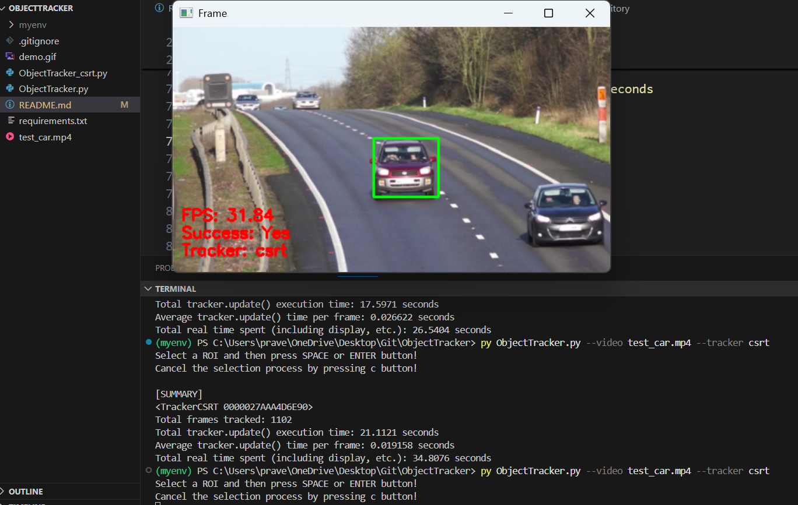

# Object Tracker using OpenCV

This project demonstrates real-time object tracking using OpenCV's built-in tracking algorithms such as **KCF**, **CSRT**, and **MIL**. You can track objects from a webcam or video file and view FPS, success status, and execution time per frame.
--
<p align="center">
  
</p>

## Features
- 📹 Supports external/webcam and video file inputs
- 🎯 Real-time object tracking with multiple OpenCV algorithms
- 🕒 Displays FPS and total execution time
- 📈 Prints performance summary at the end
- ✅ ROI (Region of Interest) selector for target object
---

# Demo Image:
<p align="center">
  
</p>

## 🚀 Supported Trackers

- `csrt` - Discriminative Correlation Filter with Channel and Spatial Reliability
- `kcf` - Kernelized Correlation Filters
- `mil` - Multiple Instance Learning

>  Other trackers (`tld`, `mosse`, `boosting`, `medianflow`) may not work with OpenCV ≥ 4.11 due to API changes.

## 🛠 Installation

### 1. Clone the repository

```bash
git clone https://github.com/praveensunkara19/ObjectTracker.git
cd ObjectTracker

2. Set up virtual environment (optional but recommended)
```bash
python -m venv myenv
myenv\Scripts\activate    # On Windows

3. Install dependencies
```bash
pip install -r requirements.txt
Note: Use opencv-contrib-python for tracker support.

Dependencies
Python 3.8+

opencv-contrib-python==4.5.5.64
imutils
numpy==1.23.5
```
# How to Run the setup in local:
for csrt: 
```bash
python ObjectTracker_csrt.py
```
for - csrt | kcf | mil 
Using Webcam:
```bash
python ObjectTracker.py --tracker kcf
```
Using Video:
```bash
python ObjectTracker.py --video path/to/video.mp4 --tracker csrt   #test_car.mp4
```

During Execution:
Press S to select an object to track
Press Q to quit the application

📊 Tracking Summary Output
At the end of tracking, you will get:

--
[SUMMARY]
"Tracker<csrt>
Total frames tracked: 100
Total tracking execution time: 4.2156 seconds
Average tracker.update() time: 0.042156 seconds
Total real time spent (including display, etc.): 5.1204 seconds
 Sample Output Frame


🙋 Author
Praveen Sunkara
GitHub: @praveensunkara19
Email: praveesunkara19@gmail.com

📜 License
This project is licensed under the MIT License.
---

